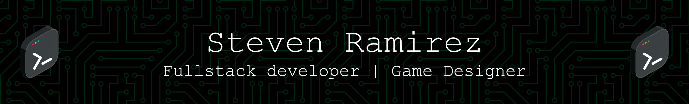

  <h1> About Me</h1>
  
 Hello, my name is Steven Ramirez. I am a fullstack developer with MERN, and a Game Designer. I attended a 15 week bootcamp with Per Scholas to learn HTML, CSS, JS and of course the MERN stack (MongoDB, Express, React and Node). I attended Columbia College of Chicago to obtain my Game Design degree and graduated in 2022

  <h2> Current Projects</h2>
  <ul>
    <li>Video Game:video_game:: <a href="https://github.com/sramirez124/GetALife">Get a Life</a></li>
    <li>Website:page_facing_up:: <a href="https://github.com/sramirez124/GetALife">Personal Portfolio</a></li>
    <li>MERN Stack Capstone:computer:: <a href="https://github.com/sramirez124/GetALife">Per Scholas Capstone</a></li>
  </ul>

<h1>Github Stats</h1>

  

<!--
**sramirez124/sramirez124** is a ✨ _special_ ✨ repository because its `README.md` (this file) appears on your GitHub profile.

Here are some ideas to get you started:

- 🔭 I’m currently working on ...
- 🌱 I’m currently learning ...
- 👯 I’m looking to collaborate on ...
- 🤔 I’m looking for help with ...
- 💬 Ask me about ...
- 📫 How to reach me: ...
- 😄 Pronouns: ...
- ⚡ Fun fact: ...
-->
